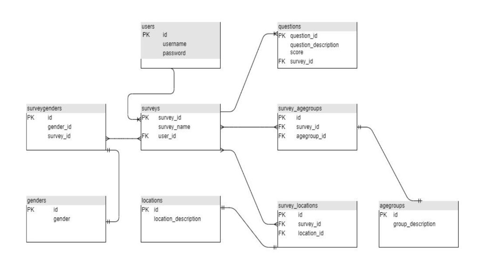
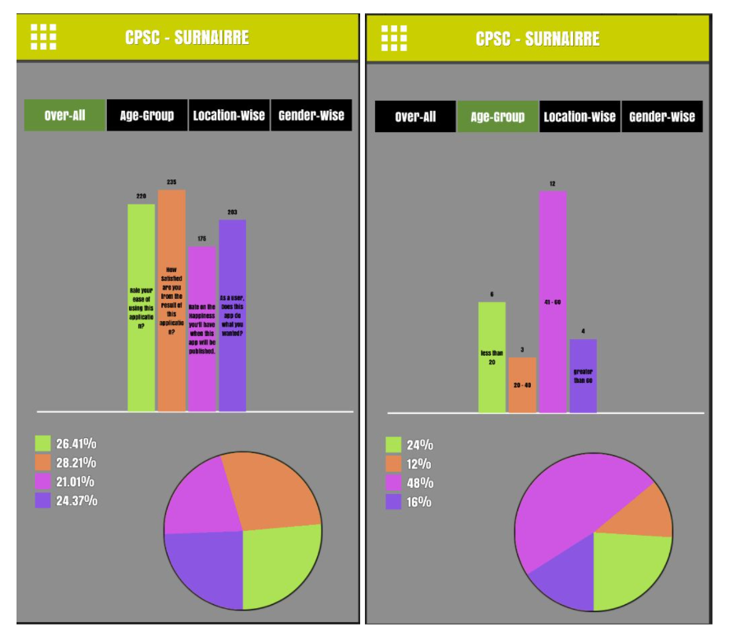

# CPSC671Project
 The purpose of this project is to build a Questionnaire Survey Application to provide an interface to the users to create different surveys and analyze the survey details. The scope of the application is divided into two parts: participation and creation. 
 - In Participation any user can use the application and participate in any surveys and submit the data to be analyzed.
 - In Creation the user with admin access can create a survey which later the participant will use and then the creator can use the application to do the analysis of the survey depending on various matrix like questions score, genders participation, different age groups and from different regions.
 - The backend has been implemented using Flask and SQLAlchemy in python to generate REST API. Some dependencies that are mentioned in the Readme file need to be installed first for running the API locally.

